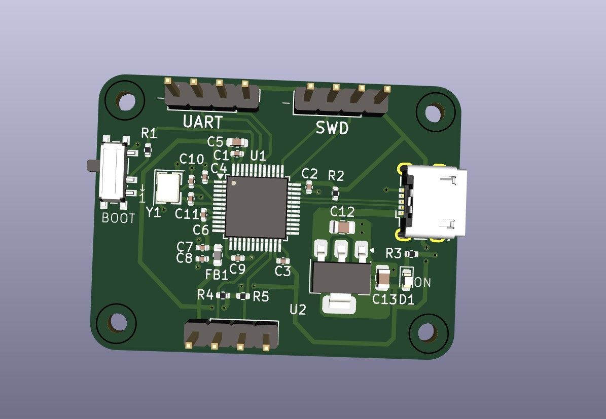
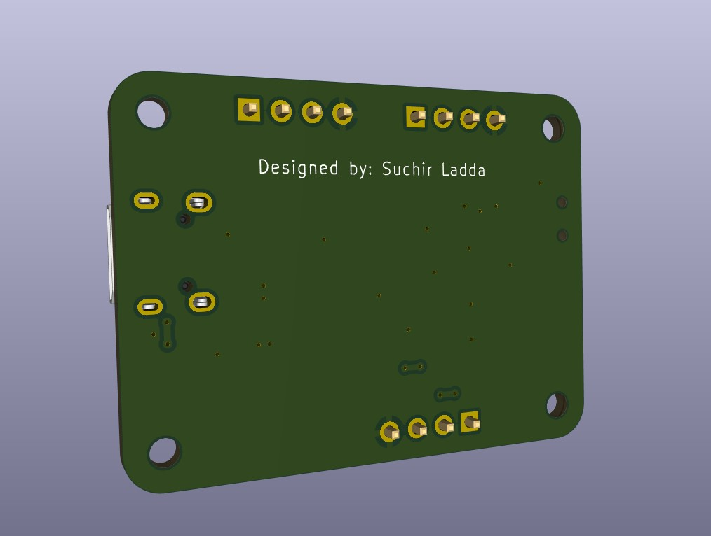

# Stemma32
Custom STM32 dev board with UART, I²C, USB, and SWD interfaces. Designed in KiCad for embedded prototyping.

## Overview
A custom-designed STM32 development board featuring UART, I²C, and USB communication interfaces, intended for embedded systems prototyping and peripheral interfacing. This board is built around the STM32F103C8T6 microcontroller and includes key components such as an external crystal oscillator, onboard boot configuration switch, SWD programming header, and power regulation circuitry.

Pin layout and peripheral configuration were assisted by STM32CubeIDE, which was used to validate the pin mappings and peripheral assignments during design.

## Features
- STM32F103C8T6 MCU
- USB-to-Serial (UART) communication
- UART and I²C breakout for peripherals
- SWD programming/debug interface
- Onboard 3.3V AMS1117 voltage regulator
- External 8 MHz crystal oscillator
- Boot configuration slide switch  
- KiCad 8 project files included

## Repository Contents
- `/kicad/` – Schematic and PCB layout
- `/images/` – 3D model and board render

### Front View – 3D PCB Render

### Rear View – 3D PCB Render

## 🤝 Sponsorship

This board was manufactured and assembled with the generous support of **[PCBWay](https://www.pcbway.com/)**.
The production quality and turnaround time were excellent — from fabrication to component assembly, everything arrived perfectly aligned and functional.
I highly recommend PCBWay for your custom PCB projects. You can check them out [here](https://www.pcbway.com/) 
